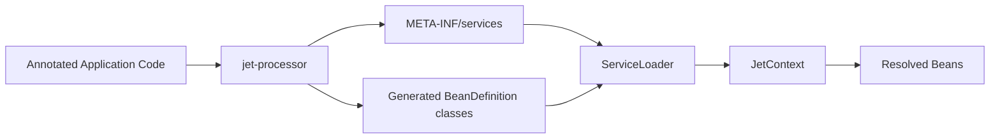

<div align="center">

# JET

**A compact Java dependency injection framework with a flight plan of its own.**


[Overview](#overview) • [Getting Started](#getting-started) • [Example Guide](jet-example/README.md) • [Usage](#usage) • [Core Concepts](#core-concepts) • [Architecture](#architecture) • [Limitations](#limitations)

</div>

## Overview

JET is a small annotation-driven dependency injection framework built in Java. It uses compile-time annotation processing to generate bean definitions, then loads those definitions at runtime with Java's `ServiceLoader`. The result is intentionally simple: no XML, no runtime classpath scanning, and no large framework lifecycle to learn.

The project is also deliberately a little more memorable than another `@Inject` / `@Singleton` clone. Classes can be marked as `@Jet`, factory classes live in a `@Hangar`, factory methods produce `@Part`s, dependencies enter through an `@Intake`, qualifiers are called `@Fuel`, and a preferred candidate is `@Maverick`. The naming is playful; the mechanics are still serious.

> [!NOTE]
> This repository is best read as both a usable mini-framework and an engineering portfolio project. It focuses on dependency resolution, generated metadata, qualifier handling, primary candidate selection, and clear runtime failures rather than breadth of features.

## Why I Built This

JET was built as a learning-focused project to understand how dependency injection containers work under the hood: annotation processing, generated metadata, service discovery, dependency graphs, scopes, qualifiers, and failure reporting.

It is intentionally small. The goal is not to replace Spring, Guice, or Dagger, but to explore the mechanics behind them with readable code and explicit trade-offs.

## Features

- Compile-time generation of `BeanDefinition` classes for annotated beans and factory methods.
- Runtime container bootstrapped through `ControlTower.run(...)`.
- Lazy singleton creation for generated beans.
- Constructor injection for `@Jet` classes.
- Factory-method injection through `@Hangar` and `@Part`.
- Type plus qualifier resolution with `@Fuel` and `Qualifier`.
- Primary candidate selection for `@Part` methods with `@Maverick`.
- Circular dependency detection with a readable dependency path.
- Small exception hierarchy for framework-specific failures.

## Project Structure

| Module | Purpose |
| --- | --- |
| `jet-core` | Runtime API, annotations, context, registry, qualifiers, scopes, and exceptions. |
| `jet-processor` | Annotation processor that generates `BeanDefinition` implementations and `META-INF/services` metadata. |
| `jet-example` | Runnable Notification Center sample. See [`jet-example/README.md`](jet-example/README.md) for the walkthrough and experiments. |

## Getting Started

### Prerequisites

- JDK 21
- Gradle is provided through the wrapper (`./gradlew` or `gradlew.bat`)

### Build Everything

```bash
./gradlew build
```

On Windows PowerShell or CMD:

```powershell
.\gradlew.bat build
```

### Run The Example

```bash
./gradlew :jet-example:run
```

On Windows PowerShell or CMD:

```powershell
.\gradlew.bat :jet-example:run
```

The example is the best starting point for learning the framework. Read [`jet-example/README.md`](jet-example/README.md), run the example from the repository root, and then experiment with the annotations in `jet-example/src/main/java/org/mclavo/example`.

### Run Core Tests

```bash
./gradlew :jet-core:test
```

## Usage

JET is currently used from source as a Gradle multi-project build. A module that wants to use the framework needs the core runtime and the annotation processor:

```groovy
dependencies {
    annotationProcessor project(':jet-processor')
    implementation project(':jet-core')
}
```

`jet-example/build.gradle` also declares `implementation project(':jet-processor')` while developing inside this repository, but application code uses the public runtime API from `jet-core`.

For a complete runnable walkthrough, use the Notification Center guide in [`jet-example/README.md`](jet-example/README.md). It explains `@Jet`, `@Intake`, `@Hangar`, `@Part`, `@Fuel`, `@Maverick`, and `JetContext.provide(...)` with concrete files you can modify and run.

## Core Concepts

### Annotation Vocabulary

| Annotation | Implemented behavior |
| --- | --- |
| `@Jet` | Marks a class as a generated container-managed bean. |
| `@Hangar` | Marks a class that owns `@Part` factory methods. A hangar with parts also gets a generated bean definition so its methods can be called by the container. |
| `@Part` | Marks a factory method inside a `@Hangar`. The method return type becomes the registered bean type. |
| `@Intake` | Selects the constructor to use when a `@Jet` or generated hangar bean has multiple constructors. |
| `@Fuel` | Qualifies a `@Part` method or an injected constructor/factory parameter. Blank values map to no qualifier. |
| `@Maverick` | Marks a `@Part` method as primary for candidate resolution. |
| `@JETMISSION` | Runtime-retained application metadata marker. It is not currently required by `ControlTower.run(...)`. |

`@Altitude`, `@Afterburner`, and `@Ignition` are present as annotations but are not wired into generation or runtime behavior yet.

### Dependency Resolution

JET resolves dependencies by registered type and optional `Qualifier`:

```java
context.provide(MyService.class);
context.provide(NotificationSender.class, "email");
context.provide(MessageFormatter.class, Qualifier.of("json"));
```

Resolution rules are intentionally small:

- If exactly one bean exists for a type, it is returned even if it has a qualifier.
- If multiple beans exist for a type and exactly one is primary, the primary is returned.
- If a qualifier is provided, only candidates with that qualifier are considered.
- If multiple matching candidates remain and there is no unique primary, `MultipleBeanCandidateException` is thrown.
- If no candidate exists, `BeanProvisionException` is thrown.

Generated definitions register the exact type they represent. For `@Jet` classes, that is the concrete class. For `@Part` methods, that is the method return type.

### Lifecycle And Scoping

Generated beans are lazy singletons. A bean is created on first resolution, then reused for later requests. The generated definition uses `ScopeProvider.singletonScope(...)`, and `JetContext` also stores the initialized instance in the registry.

`ScopeProvider.prototypeScope(...)` exists in `jet-core`, but the current annotation processor does not generate prototype-scoped definitions and there is no public scope annotation yet.

### Injection Patterns

JET intentionally focuses on constructor-based dependency injection.

Implemented injection paths are:
- Constructor parameters on `@Jet` classes.
- Constructor parameters on generated `@Hangar` beans.
- Parameters on `@Part` factory methods.
- Qualified parameters with `@Fuel(...)`.

> [!NOTE]
> Field injection is not supported by design. JET favors constructor injection with `@Intake` because it:
>- makes dependencies explicit at object creation time;
>- improves immutability by allowing `final` fields;
>- makes components easier to test without container magic;
>- avoids partially initialized objects;
>- keeps the dependency graph easier to reason about.


### Configuration Model

JET uses source annotations and generated metadata as configuration. During compilation, `jet-processor` generates one `BeanDefinition` implementation per discovered `@Jet` class and `@Part` method. It also writes:

```text
META-INF/services/io.github.mclavo.jet.context.BeanDefinition
```

At runtime, `JetContext` uses `ServiceLoader<BeanDefinition>` to discover and register those definitions. The `bootClass` passed to `ControlTower.run(...)` is currently accepted as bootstrap metadata; it does not filter packages or drive scanning.

### Error Handling

JET reports failures at the phase where they are easiest to understand:

- Compile-time processor errors for invalid generated definitions, such as a class with multiple constructors and no unique `@Intake` constructor.
- `BeanDefinitionLoadingException` when generated definitions cannot be loaded through `ServiceLoader`.
- `BeanProvisionException` when a bean cannot be resolved.
- `MultipleBeanCandidateException` when resolution finds ambiguous candidates.
- `CircularDependencyException` when the active resolution stack detects a dependency cycle.

## Architecture

The framework is split to keep responsibilities narrow:



1. Application code declares beans with annotations from `jet-core`.
2. `jet-processor` runs during compilation and generates simple Java classes implementing `BeanDefinition<T>`.
3. The processor writes ServiceLoader metadata for those generated definitions.
4. `ControlTower.run(...)` creates a `JetContext`.
5. `JetContext` loads definitions, registers them in `JetRegistry`, and resolves beans lazily.
6. Generated definitions call back into `BeanProvider` to resolve constructor and factory-method dependencies.

This design keeps runtime discovery cheap and explicit. The trade-off is that JET depends on annotation processing being configured correctly, and it currently supports a deliberately narrow set of DI features.

## Engineering Trade-Offs

JET favors readable generated code and predictable resolution over feature completeness. A list-backed registry is used instead of a more complex indexing model because the framework is not designed for very large bean graphs. Synchronization around bean creation keeps singleton initialization straightforward. Qualifiers are plain value objects rather than annotation types, which makes them easy to generate and compare.

The naming is intentionally distinctive. It helps the project feel like its own framework, but the mapping to common DI ideas stays clear: `@Jet` is a managed component, `@Hangar` is a configuration/factory class, `@Part` is a provider method, `@Intake` is an injection point, `@Fuel` is a qualifier, and `@Maverick` is a primary bean.

## Limitations

- JET requires Java 21 in the current Gradle configuration.
- Artifacts are not published from this repository; the example consumes modules directly with project dependencies.
- Generated definitions are singleton-scoped only.
- There are no lifecycle callbacks, shutdown hooks, profiles, conditional beans, or external configuration binding.
- Type resolution uses registered bean types; it does not automatically search assignable implementations for every interface or superclass.
- `@Maverick` currently applies to `@Part` methods, not `@Jet` classes.
- Duplicate type/qualifier registrations are not rejected at registration time in the current registry implementation; ambiguity is handled during resolution.
- Constructor and factory parameters are always treated as dependencies. Literal configuration values such as strings or primitives are not injected unless a matching bean exists.